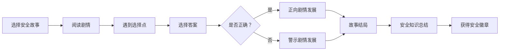

## 1. 产品概述

「归雁」是一款专为6-14岁农村留守儿童设计的情感陪伴与成长教育 Web 应用。以鸿雁传书为意象，通过温情互动弥合亲子分离的距离，在游戏化体验中守护孩子的安全与成长。

- **目标用户**：6-14岁农村留守儿童，以及在外务工的父母
- **核心价值**：降低单向思念的孤独感，培养在地认同感，提升自我保护意识
- **设计理念**：共情优先、游戏化表达、在地文化融入

## 2. 核心功能

### 2.1 用户角色

| 角色 | 使用场景 | 核心权限 |
|------|----------|----------|
| 孩子用户 | 日常使用应用，与父母互动 | 使用全部核心功能，管理个人图鉴 |
| 父母用户 | 远程查看孩子动态，参与互动 | 查看农田状态，接收孩子的消息 |

### 2.2 功能模块

1. **首页导航**：可爱归雁引导角色，四大功能入口卡片，每日心情签到
2. **父母信使鸟**：录制语音/绘画，生成带有父母虚拟形象的温情回信动画
3. **农活小游戏**：虚拟农田协作经营，播种/浇水/收获，与父母共同经营
4. **安全守护剧情**：互动式安全故事，选择分支剧情，学习安全知识
5. **乡村探索图鉴**：（后续迭代）记录家乡动植物、老建筑、方言童谣

### 2.3 页面详情

| 页面名称 | 模块名称 | 功能描述 |
|----------|----------|----------|
| 首页 | 引导角色区 | 归雁形象动态欢迎语，每日一句温暖话语 |
| 首页 | 功能入口区 | 四大功能卡片，悬浮动效，点击进入对应模块 |
| 首页 | 心情签到 | 选择今日心情表情，累计签到天数 |
| 父母信使鸟 | 录制区 | 语音录制按钮、简易绘画画布、发送按钮 |
| 父母信使鸟 | 回信展示 | 父母虚拟形象动画、语音回信播放、温情文字 |
| 农活小游戏 | 农田场景 | 网格化农田，不同作物生长阶段可视化 |
| 农活小游戏 | 操作工具栏 | 播种、浇水、施肥、收获工具按钮 |
| 农活小游戏 | 状态面板 | 当前金币、作物成熟倒计时、父母协作记录 |
| 安全守护剧情 | 故事封面 | 故事标题、封面插画、开始按钮 |
| 安全守护剧情 | 剧情展示 | 对话气泡、角色立绘、场景背景 |
| 安全守护剧情 | 选择分支 | 2-3个选项按钮，选择后进入不同剧情走向 |
| 安全守护剧情 | 知识总结 | 故事结局后展示安全小贴士和知识点 |

## 3. 核心流程

### 3.1 父母信使鸟流程

孩子打开应用 → 进入父母信使鸟 → 录制语音或绘画 → 点击发送 → 等待片刻（模拟信使鸟飞行）→ 收到父母虚拟形象的回信动画 → 播放语音/显示文字 → 可反复播放或收藏

### 3.2 农活小游戏流程

进入农田 → 查看当前田地状态 → 选择工具（播种/浇水/收获）→ 点击田地格子操作 → 作物生长进度更新 → 获得金币奖励 → 可查看父母的远程操作记录

### 3.3 安全守护剧情流程

选择安全故事 → 阅读剧情对话 → 遇到选择点 → 选择答案 → 进入不同分支 → 故事结局 → 查看安全知识总结 → 获得安全徽章

## 4. 用户界面设计

### 4.1 设计风格

- **整体调性**：温暖治愈、童趣自然、乡村田园风
- **主色调**：暖橙 `#FF8C42`（太阳/温暖）、田野绿 `#6B9E5C`（农田/生命力）
- **辅助色**：天空蓝 `#87CEEB`、麦穗黄 `#F4D03F`、泥土棕 `#8B6914`
- **背景色**：米白 `#FFF9F0`、浅绿 `#F0F7EC`
- **按钮风格**：大圆角（16-20px）、轻微立体阴影、悬浮放大效果
- **字体**：标题使用圆润可爱的「站酷快乐体」风格字体，正文使用清晰易读的无衬线字体
- **图标风格**：手绘插画风、圆润线条、填充色块
- **装饰元素**：云朵、小鸟、麦穗、小房子等乡村元素

### 4.2 页面设计概览

| 页面名称 | 模块名称 | UI 元素 |
|----------|----------|---------|
| 首页 | 引导角色区 | 归雁吉祥物插画 + 欢迎语气泡，淡入动画 |
| 首页 | 功能入口区 | 四张彩色功能卡片，图标 + 文字，悬浮抬升效果 |
| 首页 | 心情签到 | 5个表情按钮横向排列，选中放大发光 |
| 父母信使鸟 | 录制区 | 大圆形录音按钮，波形动画，简易绘画画布 |
| 父母信使鸟 | 回信展示 | 父母虚拟形象半身像，对话气泡，播放按钮 |
| 农活小游戏 | 农田场景 | 3x3 网格田地，不同作物生长阶段插画 |
| 农活小游戏 | 工具栏 | 底部横向工具栏，图标 + 文字标签 |
| 安全守护剧情 | 剧情展示 | 顶部场景插画，中部对话气泡，底部选项按钮 |

### 4.3 响应式

- **设计原则**：桌面端优先，移动端适配
- **断点设置**：移动端（< 768px）单栏布局，平板/桌面端多栏布局
- **触摸优化**：按钮最小尺寸 44x44px，适合儿童手指点击
- **字体自适应**：使用 rem 单位，移动端适当缩小字号

### 4.4 动效设计

- **页面过渡**：淡入 + 轻微上浮，营造轻柔感
- **按钮交互**：悬浮时轻微放大 + 阴影加深，点击时有按压反馈
- **角色动画**：归雁吉祥物有轻微的上下浮动和眨眼动画
- **作物生长**：从种子到成熟的逐帧生长动画
- **信使鸟飞行**：弧线飞行轨迹 + 翅膀扇动动画
