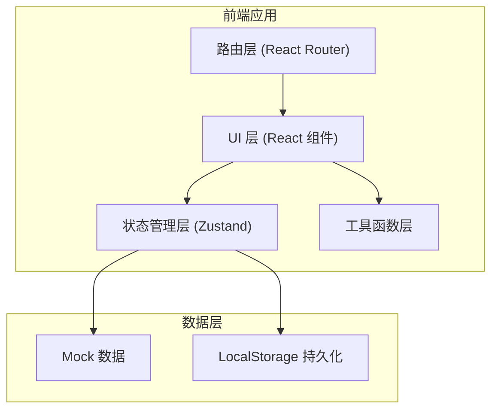

## 1. 架构设计

本项目为纯前端 Web 应用原型，采用 React 单页应用架构，所有数据使用本地 mock 数据模拟。



## 2. 技术栈说明

### 2.1 核心技术栈

| 分类 | 技术选型 | 版本 | 说明 |
|------|----------|------|------|
| 框架 | React | 18.x | 前端 UI 框架 |
| 语言 | TypeScript | 5.x | 类型安全 |
| 构建工具 | Vite | 5.x | 快速开发构建 |
| 样式 | Tailwind CSS | 3.x | 原子化 CSS |
| 状态管理 | Zustand | 4.x | 轻量状态管理 |
| 路由 | React Router DOM | 6.x | 单页路由 |
| 图标 | Lucide React | latest | 图标库 |

### 2.2 项目初始化

- 使用 `vite-init` 脚手架的 `react-ts` 模板初始化
- 纯前端项目，不包含后端
- 数据使用 mock 数据 + LocalStorage 持久化

## 3. 路由定义

| 路由路径 | 页面组件 | 功能说明 |
|----------|----------|----------|
| `/` | Home | 首页：引导角色 + 功能入口 + 心情签到 |
| `/messenger` | Messenger | 父母信使鸟：录制/绘画 + 回信动画 |
| `/farm` | Farm | 农活小游戏：虚拟农田 + 协作经营 |
| `/safety` | Safety | 安全守护剧情：互动故事 + 安全知识 |
| `/explore` | Explore | 乡村探索图鉴：（占位页） |

## 4. 数据模型

### 4.1 用户状态

```typescript
interface UserState {
  nickname: string;
  avatar: string;
  coins: number;
  mood: string | null;
  streakDays: number;
  lastSignDate: string | null;
}
```

### 4.2 信使鸟消息

```typescript
interface Message {
  id: string;
  type: 'voice' | 'drawing';
  content: string;
  timestamp: number;
  isFromParent: boolean;
  parentAvatar?: string;
  replyText?: string;
}
```

### 4.3 农田地块

```typescript
interface FarmPlot {
  id: number;
  crop: string | null;
  stage: 'empty' | 'seed' | 'sprout' | 'growing' | 'mature';
  plantedAt: number | null;
  watered: boolean;
  fertilized: boolean;
}
```

### 4.4 安全剧情

```typescript
interface StoryNode {
  id: string;
  speaker: 'narrator' | 'character';
  characterName?: string;
  characterAvatar?: string;
  text: string;
  background?: string;
  choices?: {
    text: string;
    nextNodeId: string;
    isCorrect?: boolean;
  }[];
  isEnding?: boolean;
  safetyTip?: string;
}
```

## 5. 组件结构

```
src/
├── components/
│   ├── layout/
│   │   ├── Header.tsx        # 顶部导航栏
│   │   └── BottomNav.tsx     # 底部导航（移动端）
│   ├── messenger/
│   │   ├── VoiceRecorder.tsx # 语音录制组件
│   │   ├── DrawingCanvas.tsx # 绘画画布组件
│   │   ├── FlyingBird.tsx    # 信使鸟飞行动画
│   │   └── ReplyCard.tsx     # 回信展示卡片
│   ├── farm/
│   │   ├── FarmGrid.tsx      # 农田网格
│   │   ├── FarmPlot.tsx      # 单块田地
│   │   ├── Toolbar.tsx       # 工具栏
│   │   └── StatusPanel.tsx   # 状态面板
│   ├── safety/
│   │   ├── StoryCover.tsx    # 故事封面
│   │   ├── DialogBubble.tsx  # 对话气泡
│   │   └── ChoiceButtons.tsx # 选择按钮
│   └── common/
│       ├── GooseMascot.tsx   # 归雁吉祥物
│       ├── MoodPicker.tsx    # 心情选择器
│       └── FeatureCard.tsx   # 功能入口卡片
├── pages/
│   ├── Home.tsx
│   ├── Messenger.tsx
│   ├── Farm.tsx
│   ├── Safety.tsx
│   └── Explore.tsx
├── stores/
│   ├── useUserStore.ts
│   ├── useMessengerStore.ts
│   ├── useFarmStore.ts
│   └── useSafetyStore.ts
├── data/
│   ├── mockMessages.ts
│   ├── mockCrops.ts
│   └── mockStories.ts
├── utils/
│   ├── storage.ts
│   └── helpers.ts
├── App.tsx
├── main.tsx
└── index.css
```

## 6. 核心交互实现方案

### 6.1 父母信使鸟

- 使用 Web Audio API 实现简易录音（模拟）
- 使用 Canvas API 实现简易绘画功能
- CSS 动画实现信使鸟飞行动画
- 预设多条父母回信内容，随机选择生成

### 6.2 农活小游戏

- 9 宫格田地布局，每块田地独立状态
- 作物生长阶段：种子 → 发芽 → 成长 → 成熟
- 使用 setTimeout 模拟生长时间（加速版演示）
- 收获获得金币，金币可购买种子/道具
- 模拟父母远程操作记录

### 6.3 安全守护剧情

- 剧情节点数据驱动，分支选择式叙事
- 打字机效果展示对话文字
- 每段故事有多个结局（正确/错误选择导向不同结局）
- 结局后展示安全知识小贴士
- 完成故事获得安全徽章
